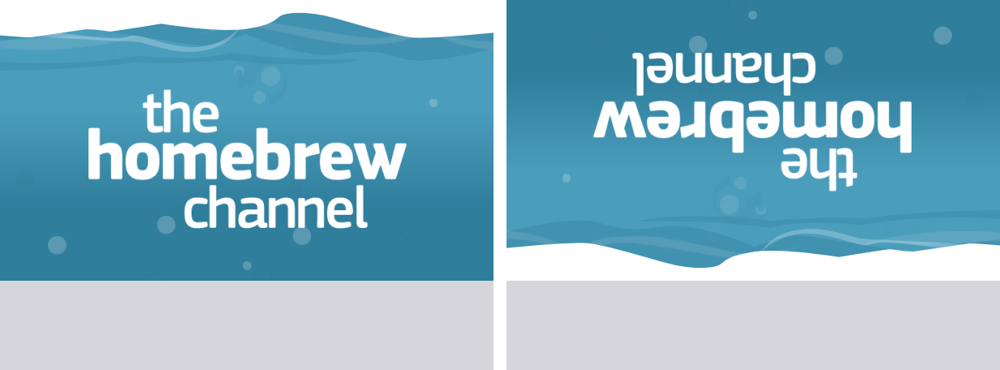
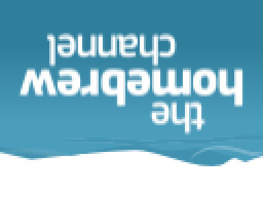
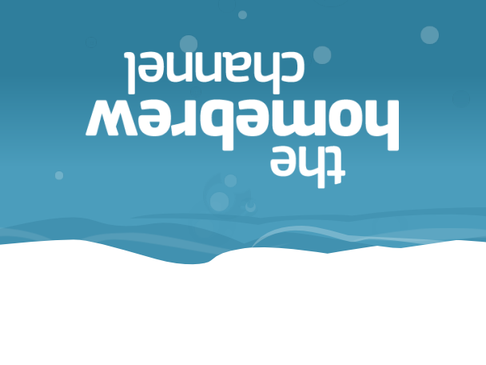
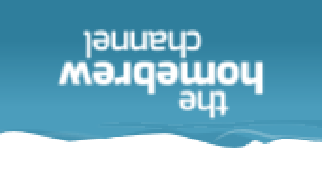
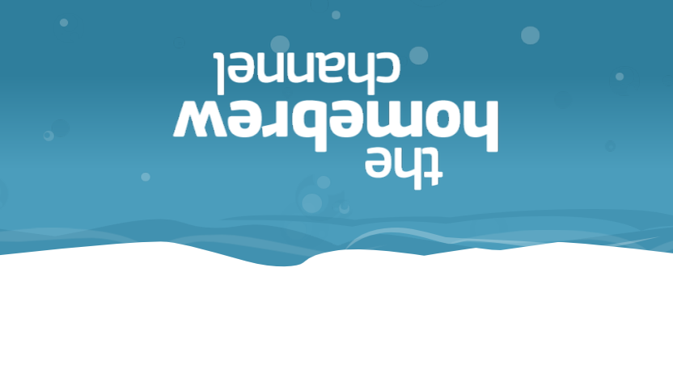
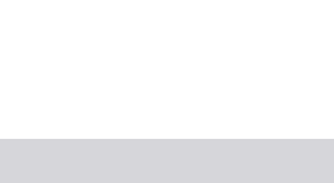

# The Homebrew Channel, Upside Down

Channel forwarder for Homebrew Channel, now turned on its head. Made for [ZodiaKGalXy's GBAtemp thread](https://gbatemp.net/threads/i-want-to-turn-the-homebrew-channel-banner-upside-down-how.684770/) (his concept art, my banner surgery).



## Screenshots

<table>
  <thead>
    <tr>
      <th width="50%">4:3 Icon</th>
      <th width="50%">4:3 Banner</th>
    </tr>
  </thead>
  <tbody>
    <tr>
      <td></td>
      <td></td>
    </tr>
  </tbody>
</table>

<table>
  <thead>
    <tr>
      <th width="50%">16:9 Icon</th>
      <th width="50%">16:9 Banner</th>
    </tr>
  </thead>
  <tbody>
    <tr>
      <td></td>
      <td></td>
    </tr>
  </tbody>
</table>

The intro plays upside down too: the water pours in from the top and the bubbles sink.



## Installing

1. Install `Homebrew Channel Upside Down - UHBC [cmyksoda].wad` with any WAD manager.
2. You still need the real Homebrew Channel installed. This channel only opens it.

It works with every Homebrew Channel version: it tries the title IDs `OHBC` (1.1.4+), `LULZ` (1.0.8 to 1.1.3), `JODI`, `HAXX`, then the 1.0 betas, and opens the first one that's installed. If none are, it goes back to the Wii Menu.

Want to build it yourself? See [BUILDING.md](BUILDING.md).

---

## Tutorial: How a forwarder channel is put together

New to these files? Here's some important words to understand:

- **WAD**: the file you install a channel from.
- **Title ID**: the four-letter code that tells channels apart (`LULZ` is the Homebrew Channel, this one is `UHBC`).
- **Forwarder**: a channel that just starts something else.
- **Archive (U8)**: a folder packed into one file, like a `.zip`.
- **Pane**: one piece of a layout, either a picture or an invisible group holding other panes.
- **Keyframe**: a value at a given frame. The Wii fills in the frames between.
- **Benzin**: a tool that turns layout and animation files into editable XML, and back.

Almost every homebrew forwarder WAD, including all the recoloured HBC forwarders on MarioCube, is the same three files:

| Content | What it is | In this channel |
|---|---|---|
| `00000000.app` | The banner: an `IMET` header (channel names), then a U8 archive with `icon.bin`, `banner.bin` and `sound.bin` | The Homebrew Channel's own banner, flipped |
| `00000001.app` | The NAND loader. The Wii boots this, and it loads the next content | The common NAND loader most forwarder WADs ship |
| `00000002.app` | The forwarder: a tiny program that starts something else | `forwarder/source/main.c`, which starts the Homebrew Channel |

The ticket and TMD around them say which title ID the channel installs as (this one is `UHBC`, so it sits next to your real HBC instead of replacing it).

`icon.bin` is the picture in the Wii Menu grid, `banner.bin` is the one you see after clicking the channel, and `sound.bin` is its music.

## How the banner works

`icon.bin` and `banner.bin` are both archives with the same three folders:

- `arc/timg/*.tpl`: the pictures (textures), e.g. the waves, the bubbles, the "the homebrew channel" logo.
- `arc/blyt/*.brlyt`: the **layout**. It describes a tree of **panes**. Each pane has a position (translate), rotation, scale, size and transparency. Picture panes also point at a material, which points at a texture. A child pane is placed *relative to its parent*, so moving or rotating a parent carries all of its children with it.
- `arc/anim/*.brlan`: the **animations**. For each pane they list keyframes: "at frame 0, Y is -320; at frame 160, Y is 0". Each keyframe also has a slope, which controls how smoothly the game curves between them. The banner has two: `banner_Start` plays once when you open the channel (360 frames, 6 seconds), then `banner_Loop` repeats (960 frames, 16 seconds).

Positions are measured from the centre of the banner, and y grows **upward** (unlike most image editors): the top edge is y = 228 and the bottom edge is y = -228. Animations run at 60 frames a second.

The Homebrew Channel's banner layout looks like this:

```
RootPane
├── background        white backdrop
├── water             everything inside moves together as the water rises
│   ├── wavea, waveb        the body of the water and its surface
│   ├── wave1a, wave1b1/2   white wave lines on the surface
│   ├── shadow, fade        shading
│   └── bubbles             60+ bubble panes, each with its own path and fade
├── title             "the homebrew channel"
└── boom              a white flash when the title appears
```

So the intro you know is really just these keyframes: `water` rises from y=-320 to 0 over the first 160 frames, the bubbles float up, `boom` flashes white at frame 244, and `title` fades in behind the flash.

## How the flip works

Turning the whole banner upside down only takes editing the **four panes directly under `RootPane`**, because everything else is their children and follows along.

For each of `background`, `water`, `title` and `boom`:

1. **Layout:** add 180 to the Z rotation, and move the pane from `(x, y)` to `(-x, 110 - y)`.
2. **Animations:** do the same to every keyframe of that pane. X values become `-x`, Y values become `110 - y`, and both slopes flip sign so the curves still ease the same way.

Why 180° rotation and not a mirror? The concept art is rotated: "homebrew" reads right to left and "the" ends up bottom right. A rotation also keeps every picture facing forwards. A mirror would need a negative scale, and we'd rather not find out whether the Wii Menu draws back-facing pictures.

Why `110 - y` and not just `-y`? The Wii Menu covers the bottom of every banner with its "Wii Menu / Start" buttons, from about y = -118 down. The banner is 456 tall (y = +228 to -228), so what you actually see is +228 down to -118. The Homebrew Channel's designers put the wave line near the top of that. A plain rotation would hide the waves behind the buttons, and show the unseen bottom strip at the top. Flipping around the middle of the *visible* part (`228 + (-118) = 110`) puts the waves and the white foam just above the buttons, like the concept art. The `background` pane is also made 220 taller so it still covers everything after the move.

The icon gets the same treatment with a shift of 0, because nothing covers it.

### A worked example

The `title` pane in `banner.brlyt`, as Benzin shows it:

```xml
<translate>
    <x>0.000000</x>
    <y>32.000000</y>     <!-- becomes 78, which is 110 - 32 -->
</translate>
<rotate>
    <z>0.000000</z>      <!-- becomes 180 -->
</rotate>
```

One keyframe of the `water` pane in `banner_Start.brlan`:

```xml
<triplet>
    <frame>0.000000</frame>      <!-- frames never change -->
    <value>-320.000000</value>   <!-- becomes 430, which is 110 - (-320) -->
    <blend>0.000000</blend>      <!-- the slope: flip its sign -->
</triplet>
```

So the water now starts above the banner and pours in from the top. `RLVC` blocks (the flash and the fades) don't need changing.

### Doing it by hand

You can do this without scripts, with any tool that unpacks a WAD and [Benzin](https://wiibrew.org/wiki/Benzin), which converts `.brlyt`/`.brlan` to XML and back:

1. Take `00000000.app` out of a Homebrew Channel WAD, then `banner.bin` and `icon.bin` out of that. Each is LZ77-compressed with an `IMD5` header in front.
2. `benzin r banner.brlyt banner.xmlyt`, then in the XML find the `<tag ... name="background">` (and `water`, `title`, `boom`) blocks. Change `<rotate><z>` to 180 and the `<translate>` x and y as above. In `background`, also add 220 to `<height>`.
3. `benzin r banner_Start.brlan banner_Start.xmlan`. Under `<pane name="water">` and `<pane name="title">`, change each `<value>` and `<blend>` (the slope) as above. Do the same for `banner_Loop` and for `icon.brlan`.
4. `benzin m` each file back, put them back in the archives, and pack the channel with the NAND loader and forwarder from any HBC forwarder WAD.

For the icon, use 0 instead of 110 (y just becomes `-y`). It has no `boom` pane.

---

## Credits

- **ZodiaKGalXy** for the idea and the concept art.
- **Team Twiizers / fail0verflow** for the Homebrew Channel and its banner, whose source is [public under the GPL](https://github.com/fail0verflow/hbc).
- **SquidMan, comex and megazig** for Benzin.
- **ForwarderFactory** and **MarioCube** for archiving the Homebrew Channel and its forwarders.
- Made by **cmyksoda**.

## License

GPLv3, see `LICENSE`. The Homebrew Channel's banner art is fail0verflow's, under GPLv2 or later.
